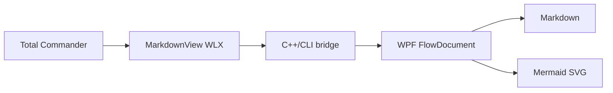
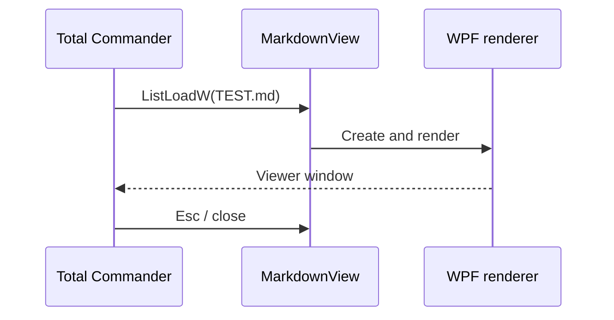

# MarkdownView 2.9.4 — тестовый документ

Этот файл проверяет основные возможности WLX-плагина MarkdownView для Total Commander
и Double Commander под Windows.
Документ обрабатывается локально через Markdig и отображается как WPF `FlowDocument`.
WebView2, Internet Explorer, JavaScript, PHP и сетевой браузерный движок не используются.

## Проверка управления

1. Откройте `TEST.md` в Total Commander или Double Commander клавишей **F3**.
2. Убедитесь, что документ появляется без пустого промежуточного окна.
3. Проверьте выделение и копирование текста.
4. Нажмите кнопку копирования в правом верхнем углу любого блока кода. В буфер должен попасть
   исходный код без ограждения и имени языка, а кнопка на две секунды должна показать галочку.
5. После нажатия кнопки копирования нажмите **Esc** — окно Lister должно закрыться.
6. Выполните поиск через Lister и повторите поиск вперёд и назад.
7. В Double Commander повторите проверку в режиме Quick View.
8. Повторите проверку в светлой и тёмной теме.
9. В разделе «Блоки кода» проверьте разные цвета комментариев, строк, ключевых слов,
   чисел, литералов, переменных, операторов и команд PowerShell.
10. В разделе «Список задач» убедитесь, что видны как отмеченные, так и пустые checkbox.

## Заголовки

### Заголовок третьего уровня

#### Заголовок четвёртого уровня

##### Заголовок пятого уровня

###### Заголовок шестого уровня

Заголовок Setext H1
===================

Заголовок Setext H2
-------------------

## Абзацы и строчная разметка

Это обычный абзац с русским и English text.\
Эта строка отделена принудительным переносом.

**Жирный текст**, *курсив*, ***жирный курсив*** и ~~зачёркнутый текст~~.

Строчный код: `MarkdownView.wlx64`. Подчёркивания внутри имени
`browser_engine_removed` не должны менять форматирование.

Экранированные символы: \*звёздочки\*, \_подчёркивания\_, \# решётка и \| черта.

Emoji из расширения Markdig: :white_check_mark: :warning: :rocket:

Встроенный HTML отключён и не должен создавать элемент интерфейса:

<button>Это текст, а не HTML-кнопка</button>

## Ссылки

- [README проекта](Readme.md)
- [История версий](CANGELOG.md)
- [Происхождение Mermaider](ThirdParty/Mermaider/UPSTREAM.md)
- [Внешняя тестовая ссылка](https://example.com)

## Списки

- Первый пункт
- Второй пункт
  - Вложенный пункт
  - Ещё один вложенный пункт
- Многострочный пункт,
  продолженный на следующей строке

1. Первый нумерованный пункт
2. Второй нумерованный пункт
   1. Вложенный пункт
   2. Второй вложенный пункт
3. Третий пункт

## Список задач

- [x] Markdown открывается через F3
- [x] WebView2 не требуется
- [ ] Проверить закрытие окна по Esc
- [ ] Проверить контраст тёмной темы

## Цитаты

> MarkdownView отображает Markdown локально.
>
> > Вложенная цитата проверяет второй уровень.

## Блоки кода

### C++

```cpp
HWND __stdcall ListLoadW(HWND parent, WCHAR* fileName, int showFlags)
{
    return OpenMarkdownViewer(parent, fileName, showFlags);
}
```

### C#

```csharp
var document = new FlowDocument
{
    Background = Brushes.Black,
    Foreground = Brushes.White,
};
```

### PowerShell

```powershell
# Комментарий
$package = 'dist\MarkdownView-2.9.4.zip'
$exists = $true
if ($exists -and (Test-Path -LiteralPath $package)) {
    Get-FileHash -Algorithm SHA256 -LiteralPath $package
}
```

### CMD

```batch
@echo off
rem Комментарий CMD
set "PACKAGE=dist\MarkdownView-2.9.4.zip"
if exist "%PACKAGE%" call BuildMakeSetup.bat
```

### Bash/Shell

```zsh
#!/usr/bin/env bash
# Комментарий оболочки
package="dist/MarkdownView-2.9.4.zip"
if [[ -f "$package" ]]; then
    printf 'Package: %s\n' "$package"
fi
```

### JavaScript

```nodejs
// Однострочный комментарий
const version = "2.9.4";
const enabled = true;
if (enabled) {
    console.log(`MarkdownView ${version}`, 293);
}
```

### SQL

Псевдонимы `mysql`, `postgres`, `postgresql`, `pgsql`, `sqlite`, `tsql`, `mssql` и `plsql`
должны использовать ту же SQL-подсветку.

```postgresql
-- SQL-комментарий
SELECT plugin_name, version
FROM plugins
WHERE enabled = TRUE AND deleted_at IS NULL
ORDER BY version DESC
LIMIT 10;
```

### HTML/XML/SVG

```html
<!-- HTML-комментарий -->
<section class="plugin" data-version="2.9.4">
    <strong>MarkdownView &amp; WPF</strong>
</section>
```

```svg
<svg xmlns="http://www.w3.org/2000/svg" viewBox="0 0 120 30">
    <text x="5" y="20">MarkdownView</text>
</svg>
```

Блок с отступом:

    MarkdownView.wlx
    MarkdownView.wlx64

## Таблица

| Компонент | Назначение | Требуется пользователю |
|:----------|:-----------|:----------------------:|
| MarkdownView.wlx/wlx64 | Нативный WLX-хост | Да |
| Markdown-x86/x64.dll | C++/CLI-мост | Да |
| Markdown.Wpf.dll | WPF-рендерер | Да |
| Mermaider.dll | Локальные Mermaid-диаграммы | Да |
| WebView2 Runtime | Браузерный движок | Нет |

## Mermaid

Диаграмма должна строиться локально и оставаться читаемой в обеих темах.





## Горизонтальные разделители

---

***

## Длинный текст для прокрутки

Этот раздел нужен для проверки вертикальной прокрутки, выделения текста на нескольких
строках и сохранения контраста. Просмотрщик должен использовать фон и цвет документа
из одной темы. Основной текст, заголовки, ссылки, цитаты, таблицы и код должны отчётливо
различаться. Горизонтальная полоса прокрутки у основного документа не требуется.

Повтор поиска: MarkdownView, MarkdownView, markdownview, MARKDOWNVIEW.

Конец тестового документа.
